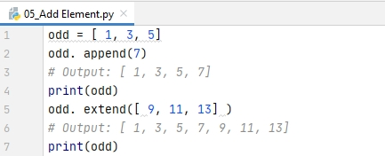

# 08_Lab 4, Lab 5

BAHASA PEMROGRAMAN

TEKNIK INFORMATIKA

UNIVERSITAS PELITA BANGSA

NAMA : GUNAWAN

NIM     : 312010191

KELAS   : TI.20.B1

DOSEN   : Agung Nugroho,S.Kom.,M.Kom

Tugas : Pertemuan 9

**List, Tuple dan Dictionary**

- **List**

• Python menawarkan berbagai tipe data
majemuk yang sering disebut sebagai
sequence. 
• List (Daftar) adalah salah satu datatype
yang paling sering digunakan dan
sangat serbaguna yang digunakan
dengan Python. 
• Pada pemrograman Python, List dibuat
dengan menempatkan semua item
(elemen) di dalam kurung siku [],
dipisahkan dengan tanda koma. 

- **How to access elements from a list?**

• To access values in lists, use the square brackets for slicing along with the
index or indices to obtain value available at that index. 
• Index starts from 0. So, a list having 5 elements will have index from 0
to 4. 
• The index must be an integer. 
Example: 
> list1 = [ ' physics' , ' chemistry' , 1997, 2000] ; 
list2 = [ 1, 2, 3, 4, 5, 6, 7 ] ; 
print ("list1[ 0] : ", list1[ 0] ) 
print ("list2[ 1: 5] : ", list2[ 1: 5] ) 

- Syntax Program Python List :

- Run Program Python :

- **Negative indexing**

• Python allows negative indexing for its sequences. 
• The index of -1 refers to the last item, -2 to the second last item and so on. 
Example: 

> my_list = [ ' p' , ' r' , ' o' , ' b' , ' e' ] 
print(my_list[ -1] ) # Output: e 
print(my_list[ -5] ) # Output: p 

- Syntax Program Python Negative indexing :

- Run Program Python :

- **How to slice lists in Python?**

• We can access a range of items in a list by using the slicing operator
(colon). 
> my_list = [ ' p' , ' r' , ' o' , ' g' , ' r' , ' a' , ' m' , ' i' , ' z' ] 
> #elements 3rd to 5th 
> print(my_list[ 2: 5] ) 
> #elements beginning to 4th 
> print(my_list[ : -5] ) 
> #elements 6th to end 
> print(my_list[ 5: ] ) 
> #elements beginning to end 
> print(my_list[ : ] ) 

- Syntax Program Python slice lists :

- Run Program Python :

- **Change or add elements in List**

• List are mutable, meaning, their elements can be changed unlike string or tuple. 
• We can use assignment operator (=) to change an item or a range of items. 

- **Change Element**

> #mistake values 
odd = [ 2, 4, 6, 8] 
#change the 1st item 
odd[ 0] = 1 
#Output: [ 1, 4, 6, 8] 
print(odd) 
#change 2nd to 4th items 
odd[ 1: 4] = [ 3, 5, 7] 
#Output: [ 1, 3, 5, 7] 
print(odd) 

- Syntax Program Python Change Element :

- Run Program Python :

- **Add Element**

• We can add one item to a list using append() method or add several items using extend() method. 

> odd = [ 1, 3, 5] 
odd. append(7) 
#Output: [ 1, 3, 5, 7] 
print(odd) 
odd. extend([ 9, 11, 13] ) 
#Output: [ 1, 3, 5, 7, 9, 11, 13] 
print(odd) 

- Syntax Program Python Add Element :

- Run Program Python :

- **Remove elements**

• We can delete one or more items from a list using the keyword del. It
can even delete the list entirely. 

> my_list = [ ' p' , ' r' , ' o' , ' b' , ' l' , ' e' , ' m' ] 
#delete one item 
del my_list[ 2] 
#Output: [ ' p' , ' r' , ' b' , ' l' , ' e' , ' m' ] 
print(my_list) 

- **Add Element**

• We can also use + operator to combine two lists. This is also called
concatenation. 
• The * operator repeats a list for the given number of times. 

> odd = [1, 3, 5] 
#Output: [1, 3, 5, 9, 7, 5] 
print(odd + [9, 7, 5]) 
#Output: ["re", "re", "re"] 
print(["re"] * 3) 

- Syntax Program Python Add Element :

- Run Program Python :

- **Remove elements**
- 
• We can delete one or more items from a list using the keyword del. It
can even delete the list entirely. 

> my_list = [ ' p' , ' r' , ' o' , ' b' , ' l' , ' e' , ' m' ] 
#delete one item 
del my_list[ 2] 
#Output: [ ' p' , ' r' , ' b' , ' l' , ' e' , ' m' ] 
print(my_list) 

- **Basic List Operations**
- 
• Lists respond to the + and * operators much like strings; they mean
concatenation and repetition here too, except that the result is a
new list, not a string. 

**Tuple**

• Tuple sama seperti List, hanya saja pada tuple datanya bersifat tetap
atau tidak dapat diubah-ubah. 
• Karena berbentuk sequences maka operasi-operasi di atas dapat
diterapkanterhadap tuples. 

> #! /usr/bin/python 
tup1 = (' physics' , ' chemistry' , 1997,2000) ; 
tup2 = (1, 2, 3, 4, 5, 6, 7 ) ; 
print ("tup1[ 0] : ", tup1[ 0] ) ; 
print ("tup2[ 1: 5] : ", tup2[ 1: 5] ) ; 

**Dictionary**

• Dictionaries adalah koleksi pasangan item-item berasosiasi dimana
setiap pasangan terdiri dari suatu key dan value. 
• Pasangan key-value ini ditulis seabagai key:value. 
• Dictionaries ditulis dipisahkan koma dalam kurung kurawal. 

> #! /usr/bin/python
dict = {' Name' : ' Zara' , ' Age' : 7, ' Class' : ' First' } 
print ("dict[ ' Name' ] : ", dict[ ' Name' ] ) 
print ("dict[ ' Age' ] : ", dict[ ' Age' ] ) 

**Accessing Values in Dictionary**

• To access dictionary elements, you can use the familiar square
brackets along with the key to obtain its value. 

> #! /usr/bin/python 
dict = {' Name' : ' Zara' , ' Age' : 7, ' Class' : ' First' } 
name = dict[ "Name"] 
age = dict[ "Age"] 
class= dict. get("Class") 
class= dict. get("Class", "Alternate value") 

**Updating Dictionary**

• You can update a dictionary by adding a new entry or a key-value pair,
modifying an existing entry 

> #! /usr/bin/python 
dict = {' Name' : ' Zara' , ' Age' : 7, ' Class' : ' First' } 
dict[ ' Age' ] = 8; # update existing entry 
dict[ ' School' ] = "DPS School"; # Add new entry 
print "dict[ ' Age' ] : ", dict[ ' Age' ] 
print "dict[ ' School' ] : ", dict[ ' School' ] 

**Delete Dictionary Elements**

• You can either remove individual dictionary elements or clear the
entire contents of a dictionary. 
• You can also delete entire dictionary in a single operation. 

> #! /usr/bin/python 
dict = {' Name' : ' Zara' , ' Age' : 7, ' Class' : ' First' } 
del dict[ ' Name' ] ; # remove entry with key ' Name' 
dict. clear() ; # remove all entries in dict 
del dict ; # delete entire dictionary 
print "dict[ ' Age' ] : ", dict[ ' Age' ] 
print "dict[ ' School' ] : ", dict[ ' School' ] 

Cukup sekian latihan materi yang di berikan oleh dosen pembimbing.

**Terimakasih**

